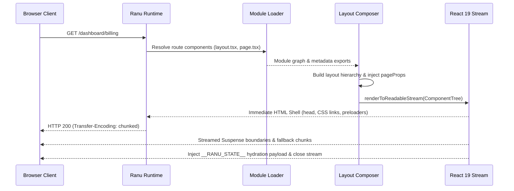

# React 19 Streaming SSR & Hydration Architecture

**Ranu.js** implements an authoritative, provider-neutral React 19 Server Renderer (`ReactRenderer`) located in `packages/react/src/`.

This document explains the internal request lifecycle, layout composition tree, W3C `ReadableStream` chunk delivery, and client hydration serialization.

---

## 1. The Rendering Lifecycle Flow

When an incoming HTTP request matches a page route, the server runtime dispatches it to the `ReactRenderer`:



---

## 2. Layout Composition Tree (`composeComponentTree`)

Ranu.js constructs the React tree hierarchically by nesting the leaf `page.tsx` within its surrounding `layout.tsx` wrappers:

```
[Document Root (<html>, <head>, <body>)]
   │
[Root Layout (app/layout.tsx)]
   │
   ├── [Parent Layout (app/dashboard/layout.tsx)]
   │      │
   │      └── [Route Page Component (app/dashboard/billing/page.tsx)]
   │
[__RANU_STATE__ Hydration Script]
```

### Component Parameters
Every page component receives resolved `PageProps`:
```typescript
interface PageProps {
  params: Promise<Record<string, string>>;
  searchParams: Promise<Record<string, string | string[]>>;
}
```

Layout components receive `LayoutProps`:
```typescript
interface LayoutProps {
  children: React.ReactNode;
  params: Promise<Record<string, string>>;
}
```

---

## 3. Streaming with W3C `ReadableStream`

Rather than accumulating the complete HTML string in memory before sending (`renderToString`), Ranu.js uses streaming rendering:

1. **Immediate Initial Byte (TTFB):** The document shell (`<!DOCTYPE html>`, `<head>`, `<link rel="stylesheet">`) is flushed to the network socket immediately upon receipt.
2. **Concurrent Chunking:** Dynamic React Server Components and `<Suspense>` boundaries stream as individual HTML chunks as asynchronous database queries resolve.
3. **Out-of-Order Injection:** Slower asynchronous fragments are swapped into their respective DOM placeholder slots via inline JavaScript micro-tasks.

---

## 4. State Hydration Protocol (`__RANU_STATE__`)

To avoid layout shifts and duplicate network queries during client-side hydration, the server serializes initial props and route state into a dedicated script tag:

```html
<script type="application/json" id="__RANU_STATE__">
  {
    "routeId": "app/dashboard/billing/page",
    "params": {},
    "searchParams": {},
    "buildId": "bld_a8f9210c",
    "publicEnv": { "RANU_PUBLIC_API_URL": "https://api.example.com" }
  }
</script>
```

### Security Escaping:
The serialized payload is escaped with Unicode entities (`\u003C` for `<`) to completely eliminate script breakout and reflected Cross-Site Scripting (XSS) vulnerabilities.

---

## 5. Control Signals: `redirect()` and `notFound()`

When server components invoke `redirect('/login')` or `notFound()`, Ranu.js catches these internal control signals before streaming begins:

* **`RedirectSignal`:** Catches signal, aborts rendering, and returns an HTTP `307 Temporary Redirect` (or specified status) with the `Location` header.
* **`NotFoundSignal`:** Catches signal and switches the rendering tree to `composeNotFoundTree()` (`app/404.tsx`), returning an HTTP `404 Not Found` response.
