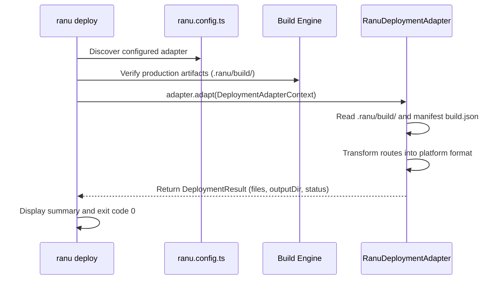

# Deployment Adapter Contract & Platform Transformation

**Ranu.js** separates application compilation from platform deployment using a formal **Deployment Adapter Contract** (`RanuDeploymentAdapter`) exported from `@ranujs/core`.

This abstraction allows the core build engine to remain completely platform-agnostic while enabling specialized adapters to transform production build outputs for any hosting target (e.g. Vercel, Cloudflare, Node.js clusters, or proprietary private clouds).

---

## 1. The Adapter Lifecycle



---

## 2. Core Interface Definitions

The contract is composed of four foundational TypeScript interfaces in `@ranujs/core`:

### `RanuDeploymentAdapter`
```typescript
export interface RanuDeploymentAdapter {
  readonly name: string;
  readonly apiVersion: number;
  readonly capabilities: DeploymentCapabilities;
  adapt(context: DeploymentAdapterContext): Promise<DeploymentResult>;
}
```

### `DeploymentCapabilities`
Declares the capabilities and operational guarantees of the hosting target:

```typescript
export interface DeploymentCapabilities {
  readonly runtime: 'node' | 'edge' | 'static';
  readonly ssr: boolean;
  readonly apiRoutes: boolean;
  readonly middleware: boolean;
  readonly streaming: boolean;
  readonly staticFiles: boolean;
  readonly runtimeEnvironment: boolean;
  readonly writableFilesystem: 'none' | 'temporary' | 'persistent';
  readonly longLivedProcess: boolean;
}
```

### `DeploymentAdapterContext`
Passed by the CLI to the adapter's `adapt()` method:

```typescript
export interface DeploymentAdapterContext {
  readonly projectRoot: string;
  readonly buildDir?: string;
  readonly outputDir?: string;
  readonly logger?: any;
}
```

### `DeploymentResult`
Returned upon completion of the transformation:

```typescript
export interface DeploymentResult {
  readonly success: boolean;
  readonly target: string;
  readonly outputDirectory: string;
  readonly files?: readonly string[];
  readonly warnings?: readonly string[];
  readonly diagnostics?: readonly any[];
}
```

---

## 3. Case Study: `@ranujs/adapter-vercel`

The official Vercel adapter demonstrates how the contract translates standard Ranu artifacts into target cloud specifications:

1. **Reads `.ranu/build/`:** Examines `build.json` to identify dynamic API routes and static pages.
2. **Generates `.vercel/output/`:**
   - Static files and client assets are copied into `.vercel/output/static/`.
   - Dynamic route handlers are bundled as standalone serverless functions inside `.vercel/output/functions/[route].func/`.
   - Route rewriting and header rules are compiled into `.vercel/output/config.json` (Build Output API v3 format).
3. **Returns Result:** Signals success to the CLI, enabling immediate execution of `vercel deploy --prebuilt`.

---

## 4. Developing Private or Custom Enterprise Adapters

Enterprise teams deploying to private cloud fabrics (e.g., custom Kubernetes orchestrators or internal serverless runtimes) can author custom adapters:

```typescript
// adapters/enterprise-cloud/index.ts
import type { RanuDeploymentAdapter, DeploymentAdapterContext, DeploymentResult } from '@ranujs/core';
import fs from 'node:fs/promises';
import path from 'node:path';

export function enterpriseCloudAdapter(): RanuDeploymentAdapter {
  return {
    name: 'enterprise-cloud',
    apiVersion: 1,
    capabilities: {
      runtime: 'node',
      ssr: true,
      apiRoutes: true,
      middleware: true,
      streaming: true,
      staticFiles: true,
      runtimeEnvironment: true,
      writableFilesystem: 'persistent',
      longLivedProcess: true,
    },
    async adapt(ctx: DeploymentAdapterContext): Promise<DeploymentResult> {
      const outputDir = path.join(ctx.projectRoot, 'dist-enterprise');
      await fs.mkdir(outputDir, { recursive: true });

      // Transform artifacts and package manifest...

      return {
        success: true,
        target: 'enterprise-cloud',
        outputDirectory: outputDir,
        files: ['server.js', 'package.json'],
      };
    },
  };
}
```

Register the adapter in `ranu.config.ts`:

```typescript
import { defineConfig } from '@ranujs/core/config';
import { enterpriseCloudAdapter } from './adapters/enterprise-cloud';

export default defineConfig({
  deployment: {
    adapter: enterpriseCloudAdapter(),
  },
});
```
