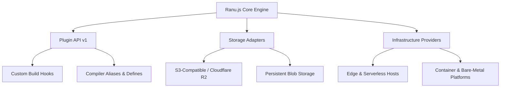

# Ranu.js Ecosystem & Partner Directory

Welcome to the **Ranu.js Ecosystem Hub**. 

While the core Ranu.js framework is 100% open-source, vendor-neutral, and strictly founded on W3C Web Standards, the **Ecosystem** is the home for extensible plugins, storage provider adapters, and verified cloud infrastructure integrations.

---

## 🧭 Ecosystem Architecture

---

## 📂 Ecosystem Sections

### 1. 🔌 [Plugin Specification (`./plugins/`)](./plugins/PLUGIN_SPECIFICATION.md)
Learn how to build reusable plugins using Ranu.js Plugin API v1.
- **`definePlugin()`** helper and metadata validation.
- Lifecycle hooks (`config`, `routes`, `buildStart`, `extendBuild`, `devStart`).
- Enforce ordering (`pre`, `normal`, `post`).
- Injecting compiler definitions (`addDefine`, `addAlias`).

---

### 2. 🗄️ [Storage Providers (`./storage/`)](./storage/README.md)
Integrate scalable file and object storage in full-stack applications.
- S3-compatible cloud storage (AWS S3, Cloudflare R2, MinIO).
- Streaming upload and download patterns using Web Standards `ReadableStream`.
- Secure pre-signed direct uploads and bucket isolation.

---

### 3. 🌐 [Infrastructure Providers (`./providers/`)](./providers/README.md)
Discover verified deployment targets and partner infrastructure.
- Edge runtimes (V8 isolates).
- Serverless cloud environments (Vercel Build Output API v3).
- Containerized enterprise platforms (Docker, Kubernetes).

---

## 🤝 Open Governance & Vendor Neutrality

Ranu.js adheres strictly to open-source governance principles:
1. **Zero Core Lock-in:** The core framework never depends on proprietary vendor APIs. All features run locally without cloud accounts.
2. **First-Party Identity:** Ranu.js maintains its own independent architecture, routing engine, and React 19 SSR renderer.
3. **Sponsorship Program Milestone:** Formal commercial sponsorship programs and partner tiers are scheduled to launch alongside the official **v1.0.0** stable release.
