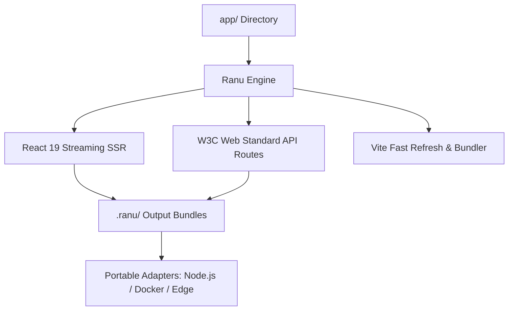

# Overview of Ranu.js

Welcome to **Ranu.js**, an independent, modern full-stack web framework designed for building scalable web applications, dynamic dashboards, REST APIs, and digital platforms.

Ranu.js is built from the ground up to unite modern Web Standards, React 19 streaming rendering, and Vite's sub-second build engine into a coherent, high-performance developer experience.

---

## 🎯 Core Mental Model

Traditional web development often forces developers to assemble disparate tools for routing, compilation, server rendering, and deployment. Ranu.js eliminates this fragmentation by providing a unified architecture:

---

## 💡 Core Pillars & Architectural Principles

### 1. Web Standards First
Ranu.js runs directly on platform primitives:
- Native `Request` and `Response` objects
- Global `fetch`, `Headers`, and `URL`
- Standard `ReadableStream` for streaming responses
- Server-Sent Events (SSE) without vendor lock-in

### 2. React 19 Native
Take full advantage of React 19 primitives:
- Streaming Server-Side Rendering (`renderReactToStream`)
- React 19 Actions (`useActionState`, `useOptimistic`)
- Seamless hydration and progressive enhancement

### 3. Explicit Execution Boundaries
Security is built into the framework design:
- Code in `app/api/` runs exclusively on the server.
- Secret environment variables never leak into client JavaScript bundles.
- Enforce strict server-side logic using `@ranujs/core/server-only`.

### 4. Zero Vendor Lock-in
Ranu.js does not mandate proprietary cloud platforms or specialized hosting infrastructure. Applications build into deterministic artifacts that deploy anywhere:
- Standalone Node.js production servers
- Lightweight, secure Docker containers
- Pluggable serverless and edge adapters

---

## 🚀 Next Steps

- Proceed to **[Installation](./02_INSTALLATION.md)** to set up your development environment.
- Review **[Project Structure](./03_PROJECT_STRUCTURE.md)** to understand file-system conventions.
