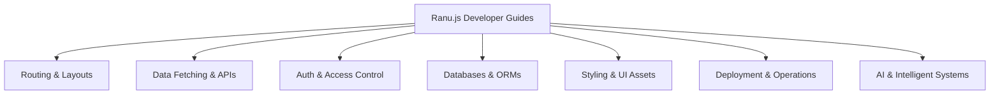

# Ranu.js Developer Guides

Welcome to the comprehensive developer guides for **Ranu.js**. 

Whether you are building simple interactive pages, complex full-stack SaaS architectures, or streaming AI workflows, these guides provide production-grade patterns based on Web Standards and React 19.

---

## 🧭 Guide Domains

---

## 1. 🛣️ [Routing & Layouts](./routing/01_PAGES_AND_LAYOUTS.md)
Master the file-system router, nested layout hierarchies, dynamic URL parameters, and zero-reload client navigation:
- **[Pages & Layouts](./routing/01_PAGES_AND_LAYOUTS.md)** — Root layout (`app/layout.tsx`) and nested layout composition.
- **[Dynamic Routes](./routing/02_DYNAMIC_ROUTES.md)** — Parameterized segments (`[id]`) and catch-all routes (`[...slug]`).
- **[Client Navigation](./routing/03_CLIENT_NAVIGATION.md)** — Native `<Link />` prefetching and active styles.
- **[Custom 404 & Errors](./routing/04_CUSTOM_404_ERRORS.md)** — Custom `app/404.tsx` error boundaries.

---

## 2. ⚡ [Data Fetching & APIs](./data-fetching/01_API_ROUTES.md)
Build REST endpoints, handle React 19 form actions, stream chunked responses, and configure HTTP caching:
- **[API Routes & Handlers](./data-fetching/01_API_ROUTES.md)** — Server route handlers (`app/api/**/route.ts`) using W3C `Request` and `Response`.
- **[Form Actions & Mutations](./data-fetching/02_FORM_ACTIONS.md)** — React 19 Actions and `useActionState` state management.
- **[Streaming Responses](./data-fetching/03_STREAMING_RESPONSES.md)** — W3C `ReadableStream` and Server-Sent Events.
- **[Caching Headers](./data-fetching/04_CACHING_HEADERS.md)** — HTTP `Cache-Control`, `stale-while-revalidate`, and edge caching.

---

## 3. 🔐 [Authentication & Access Control](./auth/01_SESSION_COOKIES.md)
Secure user sessions, safeguard downstream routes with middleware, and implement standards-compliant OAuth:
- **[Session Cookies](./auth/01_SESSION_COOKIES.md)** — Native HTTP-only `cookies()` session storage and token rotation.
- **[Protected Routes](./auth/02_PROTECTED_ROUTES.md)** — Edge `middleware.ts` guards, path matching, and redirect controls.
- **[OAuth 2.0 Integration](./auth/03_OAUTH_INTEGRATION.md)** — Vendor-neutral Authorization Code Flow with PKCE.
- **[CSRF Protection](./auth/04_CSRF_PROTECTION.md)** — Double-submit cookies, `SameSite` policies, and origin validation.

---

## 4. 🗄️ [Databases & ORMs](./database/01_SQLITE_LOCAL.md)
Persist state across embedded engines and production relational clusters with strict server isolation:
- **[Embedded SQLite](./database/01_SQLITE_LOCAL.md)** — WAL mode, zero configuration, and embedded file persistence.
- **[Production PostgreSQL](./database/02_POSTGRESQL.md)** — Connection pooling with `pg`, SSL security, and transactions.
- **[Drizzle ORM](./database/03_DRIZZLE_ORM.md)** — End-to-end TypeScript schema definitions, kit migrations, and zero-codegen queries.
- **[Prisma Setup](./database/04_PRISMA_SETUP.md)** — Declarative models, development HMR client caching, and server boundaries.

---

## 5. 🎨 [Styling & UI Assets](./styling/01_TAILWIND_CSS.md)
Design production interfaces with zero-runtime CSS modules, utility systems, and fast HMR:
- **[Tailwind CSS](./styling/01_TAILWIND_CSS.md)** — PostCSS pipeline, layout injection, and sub-second HMR updates.
- **[CSS Modules](./styling/02_CSS_MODULES.md)** — Component-scoped class names, zero runtime footprint, and composition.
- **[Static Assets & Fonts](./styling/03_ASSETS_AND_FONTS.md)** — `public/` assets, SVG vectors, and self-hosted `@font-face` optimization.

---

## 6. 🤖 [AI & Intelligent Systems](./ai/README.md)
Integrate diverse foundational models with zero vendor lock-in using pure Web Standards:
- **[Universal AI Engineering Series](./ai/README.md)** — 6-part master guide covering Streaming Foundations, Model Adapters, Structured Outputs, Vector Retrieval, Agentic Workflows, and Security Gateways.
- **[First-Party Machine Skills](../../skills/)** — Procedural rules for autonomous coding agents (`ai-universal-streaming`, `ai-model-adapters`, `ai-tool-calling`, `ai-vector-retrieval`, `ai-security-guardrails`).

---

## 7. 🚀 [Deployment & Production Operations](./deployment/01_NODE_SERVER.md)
Ship applications with confidence across bare metal, Docker containers, and cloud serverless/edge environments:
- **[Node.js Server Runbook](./deployment/01_NODE_SERVER.md)** — Production server lifecycle, PM2 clusters, and graceful shutdown.
- **[Docker Containerization](./deployment/02_DOCKER_CONTAINER.md)** — Multi-stage Alpine Dockerfile and unprivileged user hardening.
- **[Edge Runtimes & Custom Adapters](./deployment/03_EDGE_PLATFORMS.md)** — W3C Edge execution and `RanuDeploymentAdapter` contract.
- **[Vercel Adapter](./deployment/04_VERCEL_ADAPTER.md)** — First-party `@ranujs/adapter-vercel` setup and Build Output API v3.

---

## 📚 Technical API Reference & Security
- **[CLI Reference Manual](../reference/cli/README.md)** — Full command reference (`dev`, `build`, `start`, `deploy`) and flags.
- **[Configuration Reference](../reference/config/README.md)** — `ranu.config.ts` schema and `defineConfig` options.
- **[React Integration API](../reference/react/README.md)** — `<Link>`, navigation hooks, and metadata generators.
- **[Server & Runtime API](../reference/runtime/README.md)** — `cookies()`, `headers()`, `redirect()`, and server execution helpers.
- **[Security Policy & Vulnerabilities](../security/SECURITY_POLICY.md)** — Responsible disclosure, SLA, and safe harbor policy.
- **[Compiler Boundaries](../security/COMPILER_BOUNDARIES.md)** — `@ranujs/core/server-only` guards, secret protection, and ReDoS defenses.

---

## 🚀 Getting Started

If you are brand new to Ranu.js, we recommend starting with the **[Getting Started Tutorials](../getting-started/01_OVERVIEW.md)** before exploring specific guide domains.
