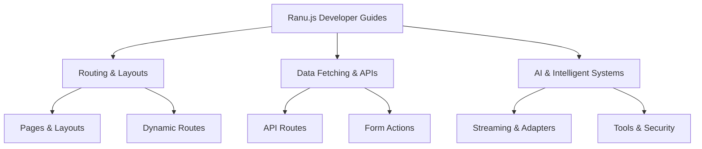

# Ranu.js Developer Guides

Welcome to the comprehensive developer guides for **Ranu.js**. 

Whether you are building simple interactive pages, complex full-stack SaaS architectures, or streaming AI workflows, these guides provide production-grade patterns based on Web Standards and React 19.

---

## 🧭 Guide Domains

---

## 1. 🛣️ [Routing & Layouts](./routing/01_PAGES_AND_LAYOUTS.md)
Master the file-system router, nested layout hierarchies, dynamic URL parameters, and zero-reload client navigation:
- **[Pages & Layouts](./routing/01_PAGES_AND_LAYOUTS.md)** — Root layout (`app/layout.tsx`) and nested layout composition.
- **[Dynamic Routes](./routing/02_DYNAMIC_ROUTES.md)** — Parameterized segments (`[id]`) and catch-all routes (`[...slug]`).
- **[Client Navigation](./routing/03_CLIENT_NAVIGATION.md)** — Native `<Link />` prefetching and active styles.
- **[Custom 404 & Errors](./routing/04_CUSTOM_404_ERRORS.md)** — Custom `app/404.tsx` error boundaries.

---

## 2. ⚡ [Data Fetching & APIs](./data-fetching/01_API_ROUTES.md)
Build REST endpoints, handle React 19 form actions, stream chunked responses, and configure HTTP caching:
- **[API Routes & Handlers](./data-fetching/01_API_ROUTES.md)** — Server route handlers (`app/api/**/route.ts`) using W3C `Request` and `Response`.
- **[Form Actions & Mutations](./data-fetching/02_FORM_ACTIONS.md)** — React 19 Actions and `useActionState` state management.
- **[Streaming Responses](./data-fetching/03_STREAMING_RESPONSES.md)** — W3C `ReadableStream` and Server-Sent Events.
- **[Caching Headers](./data-fetching/04_CACHING_HEADERS.md)** — HTTP `Cache-Control`, `stale-while-revalidate`, and edge caching.

---

## 3. 🤖 [AI & Intelligent Systems](./ai/README.md)
Integrate diverse foundational models with zero vendor lock-in using pure Web Standards:
- **[Universal AI Engineering Series](./ai/README.md)** — 6-part master guide covering Streaming Foundations, Model Adapters, Structured Outputs, Vector Retrieval, Agentic Workflows, and Security Gateways.
- **[First-Party Machine Skills](../../skills/)** — Procedural rules for autonomous coding agents (`ai-universal-streaming`, `ai-model-adapters`, `ai-tool-calling`, `ai-vector-retrieval`, `ai-security-guardrails`).

---

## 🚀 Getting Started

If you are brand new to Ranu.js, we recommend starting with the **[Getting Started Tutorials](../getting-started/01_OVERVIEW.md)** before exploring specific guide domains.
