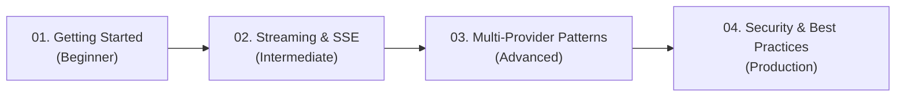

# AI Guides in Ranu.js

Welcome to the official developer guides for building AI-powered web applications with **Ranu.js**.

Ranu.js adopts a **Model-Agnostic, Web Standards First** approach to Artificial Intelligence. Rather than coupling your applications to proprietary meta-framework SDKs or vendor-specific wrappers, Ranu.js leverages native W3C Web Standards—including `ReadableStream`, `Request`, `Response`, and Server-Sent Events (SSE)—supported directly by the framework runtime.

---

## 🧭 The Learning Series (`learn/`)

Follow our progressive, step-by-step learning series to master AI development on Ranu.js:

| Guide                                                                          | Focus & Target Audience                                                                               | Estimated Reading Time |
| ------------------------------------------------------------------------------ | ----------------------------------------------------------------------------------------------------- | :--------------------: |
| **[01. Getting Started](./learn/01_GETTING_STARTED.md)**                       | Step-by-step tutorial: Build a streaming AI chat interface in Ranu.js in under 5 minutes.             |         5 mins         |
| **[02. Streaming & SSE Recipes](./learn/02_STREAMING_AND_SSE.md)**             | Deep dive into `ReadableStream`, `TextDecoderStream`, socket backpressure, and request cancellation.  |         8 mins         |
| **[03. Multi-Provider Patterns](./learn/03_MULTI_PROVIDER_PATTERNS.md)**       | Decouple your app with a universal provider switcher across cloud endpoints and local LLMs.           |        10 mins         |
| **[04. Security & Best Practices](./learn/04_SECURITY_AND_BEST_PRACTICES.md)** | Protect API keys with compiler boundaries, implement rate limiting, and prevent prompt injection/XSS. |         8 mins         |

---

## 💡 Core Architectural Philosophy

### 1. Zero Vendor Lock-in

Ranu.js does not treat any foundational model provider or cloud platform as an "official" core module. All AI integrations adhere to open, interchangeable HTTP protocols. Your application remains free to switch between upstream providers, on-premise clusters, or local models at any time.

### 2. Native Web Streams

The Ranu.js runtime streams responses directly to the client with zero buffering:

- **Automatic Backpressure:** Handles slow client network sockets via internal socket drain events.
- **Immediate Disconnect Propagation:** Client abort signals (`AbortController`) cascade through `request.signal` to terminate upstream AI inference calls immediately, saving compute costs.

### 3. React 19 First

All examples leverage React 19 client components, native state management, and streaming transitions without external UI library bloat.

---

## 🚀 Quick Navigation

- Ready to write your first AI endpoint? Jump straight to **[01. Getting Started](./learn/01_GETTING_STARTED.md)**.
- Need production hardening recipes? Review **[04. Security & Best Practices](./learn/04_SECURITY_AND_BEST_PRACTICES.md)**.
