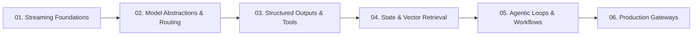

# AI Guides in Ranu.js

Welcome to the official developer guides for building AI-powered web applications with **Ranu.js**.

Ranu.js adopts a **Model-Agnostic, Web Standards First** approach to Artificial Intelligence. Rather than coupling your applications to proprietary meta-framework SDKs or vendor-specific wrappers, Ranu.js leverages native W3C Web Standards—including `ReadableStream`, `Request`, `Response`, and Server-Sent Events (SSE)—supported directly by the framework runtime.

---

## 📚 Universal AI Engineering Guides (`curriculum/`)

For software engineers building production-grade SaaS applications and multi-model interfaces, our comprehensive 6-part guide series provides deep architectural patterns and implementation recipes:

| Guide | Focus & Topics Covered | Prerequisites |
| :--- | :--- | :---: |
| **[01. Streaming Foundations](./curriculum/01_STREAMING_FOUNDATIONS.md)** | Zero-dependency streaming with W3C `ReadableStream`, SSE, backpressure, and abort signals. | Basic Web APIs |
| **[02. Model Abstractions & Routing](./curriculum/02_MODEL_ABSTRACTIONS_AND_ROUTING.md)** | Unified adapter contracts, multi-provider failover, and local/cloud runtime switching. | Guide 01 |
| **[03. Structured Outputs & Tools](./curriculum/03_STRUCTURED_OUTPUTS_AND_TOOLS.md)** | Deterministic JSON extraction, schema validation, and server-side function execution. | Guide 02 |
| **[04. State & Vector Retrieval](./curriculum/04_STATE_AND_VECTOR_RETRIEVAL.md)** | Text embeddings, in-memory cosine similarity, and contextual RAG pipelines. | Guide 03 |
| **[05. Agentic Loops & Workflows](./curriculum/05_AGENTIC_LOOPS_AND_WORKFLOWS.md)** | Autonomous ReAct loops, safety iteration limits, and human-in-the-loop checkpoints. | Guide 04 |
| **[06. Production Gateways](./curriculum/06_PRODUCTION_HARDENING_AND_GATEWAYS.md)** | Token rate-limiting, prompt injection sanitization, telemetry, and secret isolation. | Guide 05 |

---

## 🤖 Native Machine Agent Skills Ecosystem (`skills/`)

Ranu.js includes first-party, specialized machine skills adhering to open agent specifications to help autonomous AI coding assistants build secure, idiomatic features:

* **[`skills/ranu-architect/SKILL.md`](../../../skills/ranu-architect/SKILL.md)** — Core framework architecture, routing conventions, and mental models.
* **[`skills/ai-universal-streaming/SKILL.md`](../../../skills/ai-universal-streaming/SKILL.md)** — Web Streams and SSE streaming protocols.
* **[`skills/ai-model-adapters/SKILL.md`](../../../skills/ai-model-adapters/SKILL.md)** — Universal model abstraction and dynamic router patterns.
* **[`skills/ai-tool-calling/SKILL.md`](../../../skills/ai-tool-calling/SKILL.md)** — Function calling, structured JSON output, and execution sandboxing.
* **[`skills/ai-vector-retrieval/SKILL.md`](../../../skills/ai-vector-retrieval/SKILL.md)** — Text embeddings, cosine similarity, and RAG context injection.
* **[`skills/ai-security-guardrails/SKILL.md`](../../../skills/ai-security-guardrails/SKILL.md)** — Token bucket rate limiting, prompt sanitization, and secret boundaries.

---

## 🧭 Rapid Quickstart Tutorials (`learn/`)

If you want to spin up a quick streaming chat interface in under 5 minutes:

* **[01. Getting Started](./learn/01_GETTING_STARTED.md)** — Quickstart tutorial.
* **[02. Streaming & SSE Recipes](./learn/02_STREAMING_AND_SSE.md)** — Streaming deep dive.
* **[03. Multi-Provider Patterns](./learn/03_MULTI_PROVIDER_PATTERNS.md)** — Multi-provider switcher.
* **[04. Security & Best Practices](./learn/04_SECURITY_AND_BEST_PRACTICES.md)** — Production security essentials.

---

## 💡 Core Architectural Philosophy

### 1. Zero Vendor Lock-in
Ranu.js does not treat any foundational model provider or cloud platform as an "official" core module. All AI integrations adhere to open, interchangeable HTTP protocols. Your application remains free to switch between upstream providers, on-premise clusters, or local models at any time.

### 2. Native Web Streams
The Ranu.js runtime streams responses directly to the client with zero buffering:
- **Automatic Backpressure:** Handles slow client network sockets via internal socket drain events.
- **Immediate Disconnect Propagation:** Client abort signals (`AbortController`) cascade through `request.signal` to terminate upstream AI inference calls immediately, saving compute costs.

### 3. React 19 First
All examples leverage React 19 client components, native state management, and streaming transitions without external UI library bloat.
