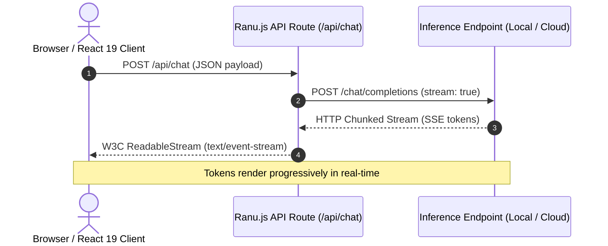

# Guide 01: Foundations — Web Streams & Inference Endpoints

Welcome to Guide 1 of the **Ranu.js Universal AI Engineering Series**.

In this guide, you will master the foundational mechanics of streaming AI responses from server API routes to client interfaces using native W3C Web Standards, without third-party wrapper libraries.

---

## 1. Why Native Web Streams Matter

Most modern generative AI models produce tokens progressively over several seconds. Traditional REST APIs block until the entire completion finishes, resulting in poor user experience and high initial latency.

By leveraging **Server-Sent Events (SSE)** and **W3C `ReadableStream`**, Ranu.js allows your application to:
1. Render the first token in milliseconds (Time-To-First-Token).
2. Avoid buffering large text payloads in server memory.
3. Terminate upstream compute calls automatically if the client disconnects or navigates away.



---

## 2. Server Implementation (`app/api/chat/route.ts`)

Create a streaming server endpoint that forwards chunks directly using the standard Web `Response`:

```typescript
// app/api/chat/route.ts

interface ChatPayload {
  prompt: string;
}

export async function POST(request: Request): Promise<Response> {
  const signal = request.signal;

  // 1. Guard against pre-aborted connections
  if (signal.aborted) {
    return new Response(null, { status: 499 });
  }

  // 2. Parse and validate input
  const { prompt } = (await request.json()) as ChatPayload;
  if (!prompt || typeof prompt !== 'string') {
    return Response.json({ error: 'Prompt must be a non-empty string.' }, { status: 400 });
  }

  const endpoint = process.env.AI_INFERENCE_URL || 'http://localhost:11434/v1/chat/completions';
  const apiKey = process.env.AI_INFERENCE_API_KEY || 'default-token';
  const modelName = process.env.AI_MODEL_NAME || 'default-model';

  // 3. Initiate upstream inference request with abort signal binding
  const upstreamRes = await fetch(endpoint, {
    method: 'POST',
    headers: {
      'Content-Type': 'application/json',
      Authorization: `Bearer ${apiKey}`,
    },
    body: JSON.stringify({
      model: modelName,
      messages: [{ role: 'user', content: prompt }],
      stream: true,
    }),
    signal,
  });

  if (!upstreamRes.ok || !upstreamRes.body) {
    return Response.json(
      { error: `Inference failed: ${upstreamRes.statusText}` },
      { status: upstreamRes.status }
    );
  }

  // 4. Return standard Server-Sent Events stream
  return new Response(upstreamRes.body, {
    headers: {
      'Content-Type': 'text/event-stream; charset=utf-8',
      'Cache-Control': 'no-cache, no-transform',
      'Connection': 'keep-alive',
    },
  });
}
```

---

## 3. Client Consumption in React 19 (`app/page.tsx`)

Build an interactive client component that consumes the stream chunk-by-chunk:

```tsx
// app/page.tsx
'use client';

import React, { useState, useRef } from 'react';

export default function StreamingChatPage() {
  const [input, setInput] = useState('');
  const [output, setOutput] = useState('');
  const [isStreaming, setIsStreaming] = useState(false);
  const abortControllerRef = useRef<AbortController | null>(null);

  async function handleSend(e: React.FormEvent) {
    e.preventDefault();
    if (!input.trim() || isStreaming) return;

    setOutput('');
    setIsStreaming(true);

    const controller = new AbortController();
    abortControllerRef.current = controller;

    try {
      const res = await fetch('/api/chat', {
        method: 'POST',
        headers: { 'Content-Type': 'application/json' },
        body: JSON.stringify({ prompt: input }),
        signal: controller.signal,
      });

      if (!res.ok || !res.body) {
        throw new Error(`Server returned error status ${res.status}`);
      }

      const reader = res.body.getReader();
      const decoder = new TextDecoder('utf-8');

      while (true) {
        const { done, value } = await reader.read();
        if (done) break;

        const rawText = decoder.decode(value, { stream: true });
        
        // Parse SSE lines
        const lines = rawText.split('\n');
        for (const line of lines) {
          if (line.startsWith('data: ') && line !== 'data: [DONE]') {
            try {
              const parsed = JSON.parse(line.slice(6));
              const token = parsed.choices?.[0]?.delta?.content || '';
              setOutput((prev) => prev + token);
            } catch {
              // Ignore partial JSON chunks during streaming
            }
          }
        }
      }
    } catch (err) {
      if ((err as Error).name !== 'AbortError') {
        setOutput((prev) => prev + `\n[Error: ${(err as Error).message}]`);
      }
    } finally {
      setIsStreaming(false);
      abortControllerRef.current = null;
    }
  }

  function handleStop() {
    abortControllerRef.current?.abort();
  }

  return (
    <main style={{ maxWidth: 640, margin: '40px auto', fontFamily: 'sans-serif', padding: 16 }}>
      <h2>Ranu.js Streaming Foundation</h2>
      <form onSubmit={handleSend} style={{ display: 'flex', gap: 8, marginBottom: 16 }}>
        <input
          type="text"
          value={input}
          onChange={(e) => setInput(e.target.value)}
          placeholder="Ask anything..."
          style={{ flex: 1, padding: '8px 12px' }}
        />
        <button type="submit" disabled={isStreaming}>Send</button>
        {isStreaming && <button type="button" onClick={handleStop}>Stop</button>}
      </form>
      <div style={{ whiteSpace: 'pre-wrap', background: '#f5f5f5', padding: 16, borderRadius: 6, minHeight: 120 }}>
        {output || 'Output will appear here...'}
      </div>
    </main>
  );
}
```

---

## 4. Key Takeaways

1. **Zero Vendor Dependencies:** Streaming requires no proprietary SDKs—standard Web `fetch` and `ReadableStream` are all you need.
2. **Backpressure & Cancellation:** Attaching `request.signal` guarantees that closing the client tab aborts upstream inference instantly.
3. **Next Step:** Proceed to **[Guide 02: Universal Model Abstraction & Routing](./02_MODEL_ABSTRACTIONS_AND_ROUTING.md)** to decouple your application from specific provider formats.
