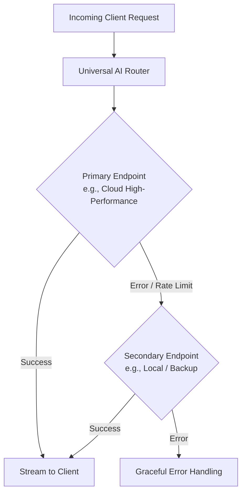

# Guide 02: Architecture — Model Abstractions & Failover Routing

Welcome to Guide 2 of the **Ranu.js Universal AI Engineering Series**.

In this guide, you will learn how to design a vendor-neutral model abstraction layer that allows your application to switch seamlessly between diverse inference providers (cloud endpoints, on-premise clusters, and local runners) with zero vendor lock-in and automatic failover.

---

## 1. The Multi-Model Challenge

Relying on a single AI provider creates single points of failure, rate limit vulnerabilities, and vendor lock-in. A production AI architecture must:
- Normalize differing provider payloads into a unified contract.
- Support runtime switching via configuration or environment variables.
- Cascadingly retry alternate endpoints if the primary provider encounters downtime or rate limits.



---

## 2. Defining the Universal Contract (`app/lib/ai/types.ts`)

```typescript
// app/lib/ai/types.ts

export type MessageRole = 'system' | 'user' | 'assistant';

export interface UniversalMessage {
  role: MessageRole;
  content: string;
}

export interface UniversalChatRequest {
  messages: UniversalMessage[];
  model?: string;
  temperature?: number;
  maxTokens?: number;
}

export interface ModelAdapter {
  readonly id: string;
  createStream(req: UniversalChatRequest, signal?: AbortSignal): Promise<ReadableStream<Uint8Array>>;
}
```

---

## 3. Creating Generic Model Adapters

### Standard Protocol Adapter (`app/lib/ai/adapters/standard-adapter.ts`)

```typescript
// app/lib/ai/adapters/standard-adapter.ts
import type { ModelAdapter, UniversalChatRequest } from '../types.js';

export class StandardInferenceAdapter implements ModelAdapter {
  constructor(
    public readonly id: string,
    private readonly baseUrl: string,
    private readonly apiKey: string,
    private readonly defaultModel: string
  ) {}

  async createStream(req: UniversalChatRequest, signal?: AbortSignal): Promise<ReadableStream<Uint8Array>> {
    const res = await fetch(`${this.baseUrl}/chat/completions`, {
      method: 'POST',
      headers: {
        'Content-Type': 'application/json',
        Authorization: `Bearer ${this.apiKey}`,
      },
      body: JSON.stringify({
        model: req.model || this.defaultModel,
        messages: req.messages,
        temperature: req.temperature ?? 0.7,
        max_tokens: req.maxTokens ?? 1024,
        stream: true,
      }),
      signal,
    });

    if (!res.ok || !res.body) {
      throw new Error(`[Adapter ${this.id}] Error: ${res.status} ${res.statusText}`);
    }

    return res.body;
  }
}
```

---

## 4. Building the Resilient Failover Router (`app/lib/ai/router.ts`)

```typescript
// app/lib/ai/router.ts
import type { ModelAdapter, UniversalChatRequest } from './types.js';

export class ResilientRouter {
  constructor(private readonly adapters: ModelAdapter[]) {
    if (adapters.length === 0) {
      throw new Error('ResilientRouter requires at least one model adapter.');
    }
  }

  async route(request: UniversalChatRequest, signal?: AbortSignal): Promise<{ adapterId: string; stream: ReadableStream<Uint8Array> }> {
    const failureLog: string[] = [];

    for (const adapter of this.adapters) {
      if (signal?.aborted) {
        throw new DOMException('Client aborted request', 'AbortError');
      }

      try {
        const stream = await adapter.createStream(request, signal);
        return { adapterId: adapter.id, stream };
      } catch (err) {
        failureLog.push(`${adapter.id}: ${(err as Error).message}`);
        // Seamlessly continue to fallback adapter
      }
    }

    throw new Error(`All providers exhausted. Log: ${failureLog.join('; ')}`);
  }
}
```

---

## 5. Using the Router in an API Route (`app/api/chat/route.ts`)

```typescript
// app/api/chat/route.ts
import { StandardInferenceAdapter } from '../../lib/ai/adapters/standard-adapter.js';
import { ResilientRouter } from '../../lib/ai/router.js';

const primary = new StandardInferenceAdapter(
  'primary-cloud',
  process.env.PRIMARY_AI_URL || 'https://api.example.com/v1',
  process.env.PRIMARY_AI_KEY || '',
  process.env.PRIMARY_AI_MODEL || 'model-a'
);

const fallback = new StandardInferenceAdapter(
  'fallback-local',
  process.env.FALLBACK_AI_URL || 'http://localhost:11434/v1',
  'local-key',
  'model-b'
);

const router = new ResilientRouter([primary, fallback]);

export async function POST(request: Request) {
  try {
    const { messages } = await request.json();
    const { adapterId, stream } = await router.route({ messages }, request.signal);

    return new Response(stream, {
      headers: {
        'Content-Type': 'text/event-stream; charset=utf-8',
        'Cache-Control': 'no-cache, no-transform',
        'X-AI-Provider': adapterId,
      },
    });
  } catch (err) {
    return Response.json({ error: (err as Error).message }, { status: 502 });
  }
}
```

---

## 6. Key Takeaways

1. **Decoupled Architecture:** Business logic never relies on specific vendor headers or SDKs.
2. **Automatic High Availability:** Failures or rate limits from one upstream host immediately cascade to the next without crashing the user session.
3. **Next Step:** Proceed to **[Guide 03: Structured Outputs & Tools](./03_STRUCTURED_OUTPUTS_AND_TOOLS.md)** to enforce deterministic JSON schemas and function calling.
