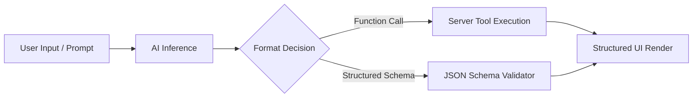

# Guide 03: Precision — Structured Outputs & Tool Calling

Welcome to Guide 3 of the **Ranu.js Universal AI Engineering Series**.

In this guide, you will learn how to extract deterministic, schema-validated JSON data from AI models and implement secure, server-side function/tool execution in **Ranu.js**.

---

## 1. Moving Beyond Freeform Text

While streaming text is great for conversational chat, production web applications require **structured data** (e.g., database records, form extraction, classification tags) and **tool invocations** (e.g., querying a database, looking up real-time weather, placing an order).



---

## 2. Defining Tools (`app/lib/ai/tools.ts`)

Define tools as self-contained units with standard JSON schemas and execution handlers:

```typescript
// app/lib/ai/tools.ts

export interface ToolDefinition<TArgs = any, TResult = any> {
  name: string;
  description: string;
  parameters: {
    type: 'object';
    properties: Record<string, { type: string; description: string }>;
    required: string[];
  };
  execute: (args: TArgs) => Promise<TResult> | TResult;
}

export const weatherTool: ToolDefinition<{ location: string }, { temperature: number; condition: string }> = {
  name: 'get_weather',
  description: 'Retrieve real-time weather conditions for a specified city.',
  parameters: {
    type: 'object',
    properties: {
      location: { type: 'string', description: 'City and state/country' },
    },
    required: ['location'],
  },
  execute: async ({ location }) => {
    // Simulated weather lookup
    return { temperature: 24, condition: `Sunny in ${location}` };
  },
};
```

---

## 3. Tool Dispatcher & Execution Sandbox (`app/api/tools/route.ts`)

Build an API route that passes tool declarations to the model, parses tool call requests, executes the selected handler, and returns the verified result:

```typescript
// app/api/tools/route.ts
import { weatherTool, type ToolDefinition } from '../../lib/ai/tools.js';

const registry = new Map<string, ToolDefinition>([
  [weatherTool.name, weatherTool],
]);

export async function POST(request: Request) {
  const { prompt } = await request.json();

  const toolsPayload = Array.from(registry.values()).map((t) => ({
    type: 'function',
    function: {
      name: t.name,
      description: t.description,
      parameters: t.parameters,
    },
  }));

  const res = await fetch(process.env.AI_INFERENCE_URL || 'http://localhost:11434/v1/chat/completions', {
    method: 'POST',
    headers: {
      'Content-Type': 'application/json',
      Authorization: `Bearer ${process.env.AI_INFERENCE_API_KEY}`,
    },
    body: JSON.stringify({
      model: process.env.AI_MODEL_NAME || 'default',
      messages: [{ role: 'user', content: prompt }],
      tools: toolsPayload,
      tool_choice: 'auto',
    }),
  });

  const data = await res.json();
  const choice = data.choices?.[0]?.message;

  // Check if model requested a tool invocation
  if (choice?.tool_calls && choice.tool_calls.length > 0) {
    const toolCall = choice.tool_calls[0];
    const toolName = toolCall.function.name;
    const tool = registry.get(toolName);

    if (!tool) {
      return Response.json({ error: `Unknown tool requested: ${toolName}` }, { status: 400 });
    }

    try {
      const parsedArgs = JSON.parse(toolCall.function.arguments);
      const executionResult = await tool.execute(parsedArgs);

      return Response.json({
        type: 'tool_result',
        tool: toolName,
        arguments: parsedArgs,
        result: executionResult,
      });
    } catch (err) {
      return Response.json({ error: `Tool execution failed: ${(err as Error).message}` }, { status: 500 });
    }
  }

  // Fallback to text message
  return Response.json({
    type: 'text_response',
    content: choice?.content || '',
  });
}
```

---

## 4. Validated Structured Outputs

When you need strictly validated JSON output without tool calls (e.g. extracting user profiles), use low temperatures and server validation:

```typescript
// app/lib/ai/structured.ts

export async function extractStrictJson<T>(
  prompt: string,
  validate: (parsed: unknown) => T
): Promise<T> {
  const systemRule = 'You are a strict data extraction engine. Return ONLY a single raw JSON object matching the requested schema. Do not include markdown ticks (```json) or conversational text.';

  const res = await fetch(process.env.AI_INFERENCE_URL!, {
    method: 'POST',
    headers: {
      'Content-Type': 'application/json',
      Authorization: `Bearer ${process.env.AI_INFERENCE_API_KEY}`,
    },
    body: JSON.stringify({
      model: process.env.AI_MODEL_NAME,
      messages: [
        { role: 'system', content: systemRule },
        { role: 'user', content: prompt }
      ],
      temperature: 0.0, // Maximum determinism
    }),
  });

  const payload = await res.json();
  const rawContent = payload.choices?.[0]?.message?.content || '{}';

  let parsed: unknown;
  try {
    parsed = JSON.parse(rawContent.trim());
  } catch {
    throw new Error(`Failed to parse AI output as JSON: ${rawContent}`);
  }

  return validate(parsed);
}
```

---

## 5. Key Takeaways

1. **Security-First Tool Execution:** Never run tool commands directly on the client. Always execute tools in server-side API routes with parameter parsing and error wrapping.
2. **Deterministic Schemas:** Combining system prompt constraints with temperature `0.0` yields dependable, machine-parsable JSON.
3. **Next Step:** Proceed to **[Guide 04: State & Vector Retrieval](./04_STATE_AND_VECTOR_RETRIEVAL.md)** to add conversational memory and RAG indexing.
