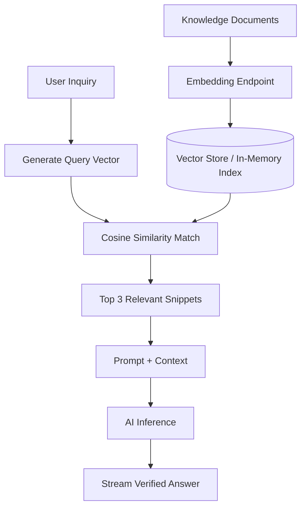

# Guide 04: Memory — Conversational State & Vector Retrieval

Welcome to Guide 4 of the **Ranu.js Universal AI Engineering Series**.

In this guide, you will learn how to manage conversational state across sessions and implement **Retrieval-Augmented Generation (RAG)** using text embeddings and vector similarity in **Ranu.js**.

---

## 1. Context Limitations & The RAG Solution

Foundational models have finite context windows. Storing an entire knowledge base directly inside prompt messages is expensive and leads to degradation in model attention.

**Retrieval-Augmented Generation (RAG)** solves this by:
1. Converting domain documents into numerical vectors (**Embeddings**).
2. Generating an embedding for the user's inquiry.
3. Calculating **Cosine Similarity** to retrieve only the top relevant document passages.
4. Injecting those verified snippets into the prompt dynamically.



---

## 2. Generating Text Embeddings (`app/lib/ai/embeddings.ts`)

Generate embeddings using standard HTTP inference endpoints without vendor SDKs:

```typescript
// app/lib/ai/embeddings.ts

export async function createEmbedding(text: string, signal?: AbortSignal): Promise<number[]> {
  const endpoint = process.env.AI_EMBEDDING_URL || 'http://localhost:11434/api/embeddings';
  const apiKey = process.env.AI_EMBEDDING_API_KEY || 'default-token';
  const model = process.env.AI_EMBEDDING_MODEL || 'embedding-model';

  const res = await fetch(endpoint, {
    method: 'POST',
    headers: {
      'Content-Type': 'application/json',
      Authorization: `Bearer ${apiKey}`,
    },
    body: JSON.stringify({ model, input: text }),
    signal,
  });

  if (!res.ok) {
    throw new Error(`Embedding request failed: ${res.statusText}`);
  }

  const json = await res.json();
  // Standard format normalization (OpenAI / Ollama / Generic endpoints)
  return json.data?.[0]?.embedding || json.embedding;
}
```

---

## 3. In-Memory Cosine Similarity & Indexing (`app/lib/ai/rag.ts`)

For edge deployments and documentation lookups, implement in-memory similarity searching:

```typescript
// app/lib/ai/rag.ts

export interface IndexedDocument {
  id: string;
  content: string;
  embedding: number[];
}

export function computeCosineSimilarity(a: number[], b: number[]): number {
  if (a.length !== b.length) throw new Error('Dimension length mismatch');

  let dotProduct = 0;
  let normA = 0;
  let normB = 0;

  for (let i = 0; i < a.length; i++) {
    dotProduct += a[i] * b[i];
    normA += a[i] * a[i];
    normB += b[i] * b[i];
  }

  const denominator = Math.sqrt(normA) * Math.sqrt(normB);
  return denominator === 0 ? 0 : dotProduct / denominator;
}

export function searchSimilarDocuments(
  queryEmbedding: number[],
  documents: IndexedDocument[],
  topK = 3
): IndexedDocument[] {
  return documents
    .map((doc) => ({
      doc,
      score: computeCosineSimilarity(queryEmbedding, doc.embedding),
    }))
    .sort((a, b) => b.score - a.score)
    .slice(0, topK)
    .map((entry) => entry.doc);
}
```

---

## 4. Serving Context-Augmented Answers (`app/api/rag/route.ts`)

```typescript
// app/api/rag/route.ts
import { createEmbedding } from '../../lib/ai/embeddings.js';
import { searchSimilarDocuments, type IndexedDocument } from '../../lib/ai/rag.js';

// Pre-indexed in-memory knowledge store (or query from database)
const knowledgeBase: IndexedDocument[] = [
  // Populate with pre-computed document embeddings
];

export async function POST(request: Request) {
  const { question } = await request.json();

  // 1. Generate query embedding
  const queryVector = await createEmbedding(question, request.signal);

  // 2. Retrieve top relevant snippets
  const matchedDocs = searchSimilarDocuments(queryVector, knowledgeBase, 3);
  const contextText = matchedDocs.map((d, i) => `[Source ${i + 1}]:\n${d.content}`).join('\n\n');

  // 3. Assemble augmented prompt
  const augmentedMessages = [
    {
      role: 'system',
      content: `You are an expert documentation assistant. Answer the user query strictly using the following sources:\n\n${contextText}`,
    },
    { role: 'user', content: question },
  ];

  // 4. Stream response
  const response = await fetch(process.env.AI_INFERENCE_URL!, {
    method: 'POST',
    headers: {
      'Content-Type': 'application/json',
      Authorization: `Bearer ${process.env.AI_INFERENCE_API_KEY}`,
    },
    body: JSON.stringify({
      model: process.env.AI_MODEL_NAME,
      messages: augmentedMessages,
      stream: true,
    }),
    signal: request.signal,
  });

  return new Response(response.body, {
    headers: {
      'Content-Type': 'text/event-stream; charset=utf-8',
      'Cache-Control': 'no-cache, no-transform',
    },
  });
}
```

---

## 5. Key Takeaways

1. **Lightweight & Portable:** In-memory vector similarity requires zero external cloud dependencies for small-to-medium knowledge bases.
2. **Context Grounding:** Grounding answers in verified snippets eliminates hallucinations.
3. **Next Step:** Proceed to **[Guide 05: Agentic Loops & Workflows](./05_AGENTIC_LOOPS_AND_WORKFLOWS.md)** to orchestrate multi-step autonomous decision loops.
