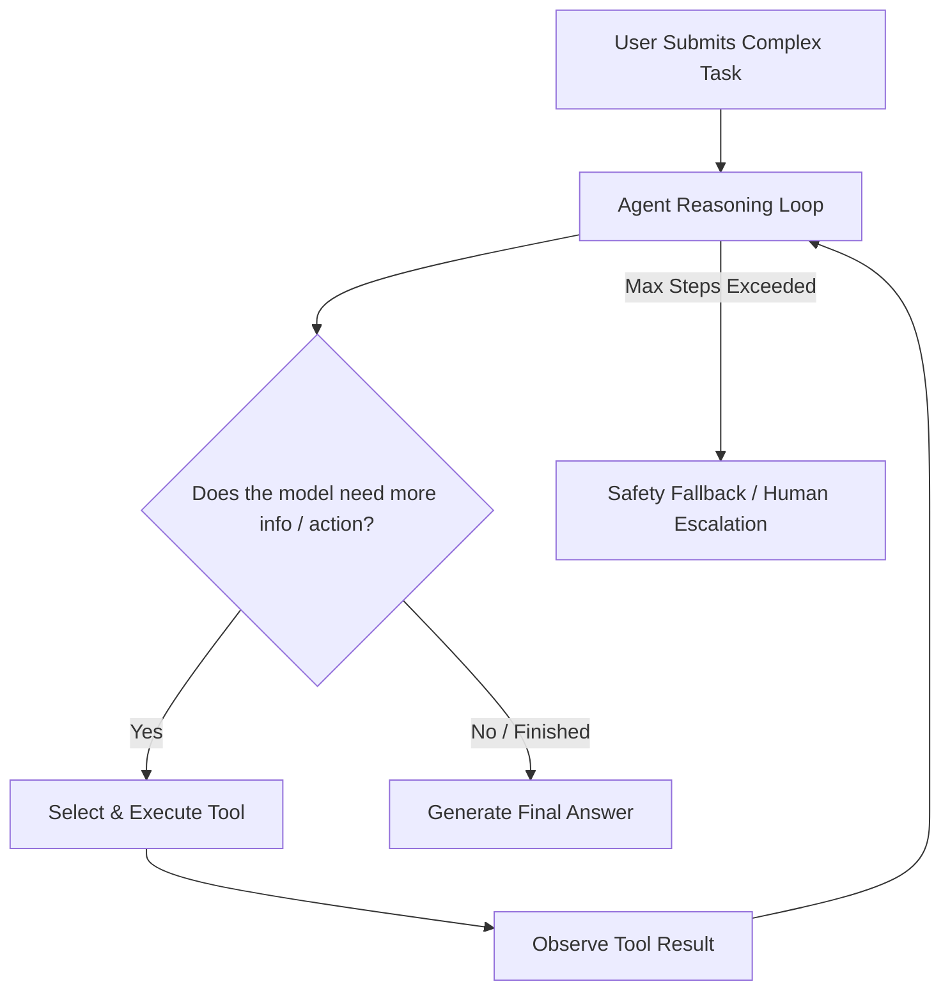

# Guide 05: Autonomy — Agentic Loops & Procedural Workflows

Welcome to Guide 5 of the **Ranu.js Universal AI Engineering Series**.

In this guide, you will learn how to build autonomous, multi-step AI agents using the **ReAct (Reasoning + Acting)** pattern, iteration guards, and human-in-the-loop validation checkpoints in **Ranu.js**.

---

## 1. What Makes an Application "Agentic"?

A basic AI chat completion is a single turn: input in, response out. An **Agentic Workflow** introduces an autonomous loop where the model can:
1. **Analyze a goal:** Reason about what steps are necessary.
2. **Execute tools:** Fetch data, call APIs, or query systems.
3. **Observe results:** Read the output of tools.
4. **Iterate or conclude:** Repeat the loop until the goal is solved or a hard recursion guard is reached.



---

## 2. Implementing the ReAct Loop (`app/lib/ai/agent.ts`)

```typescript
// app/lib/ai/agent.ts
import type { ToolDefinition } from './tools.js';

export interface AgentStep {
  thought: string;
  toolCall?: { name: string; args: any };
  toolResult?: any;
}

export interface AgentExecutionResult {
  finalResponse: string;
  steps: AgentStep[];
  success: boolean;
}

export async function runAgentLoop(
  userGoal: string,
  tools: Map<string, ToolDefinition>,
  maxSteps = 5,
  signal?: AbortSignal
): Promise<AgentExecutionResult> {
  const messages: any[] = [
    {
      role: 'system',
      content: `You are an autonomous problem-solving agent. You have tools available to achieve goals. Always reason before acting. When done, output your final answer.`,
    },
    { role: 'user', content: userGoal },
  ];

  const steps: AgentStep[] = [];
  let currentStep = 0;

  while (currentStep < maxSteps) {
    if (signal?.aborted) throw new DOMException('Agent aborted by client', 'AbortError');
    currentStep++;

    const toolsPayload = Array.from(tools.values()).map((t) => ({
      type: 'function',
      function: { name: t.name, description: t.description, parameters: t.parameters },
    }));

    const res = await fetch(process.env.AI_INFERENCE_URL || 'http://localhost:11434/v1/chat/completions', {
      method: 'POST',
      headers: {
        'Content-Type': 'application/json',
        Authorization: `Bearer ${process.env.AI_INFERENCE_API_KEY}`,
      },
      body: JSON.stringify({
        model: process.env.AI_MODEL_NAME || 'default',
        messages,
        tools: toolsPayload,
        tool_choice: 'auto',
      }),
      signal,
    });

    const data = await res.json();
    const message = data.choices?.[0]?.message;

    // Check if the agent wants to call a tool
    if (message?.tool_calls && message.tool_calls.length > 0) {
      const toolCall = message.tool_calls[0];
      const tool = tools.get(toolCall.function.name);

      if (!tool) {
        messages.push({
          role: 'tool',
          tool_call_id: toolCall.id,
          content: `Error: Tool ${toolCall.function.name} does not exist.`,
        });
        continue;
      }

      const parsedArgs = JSON.parse(toolCall.function.arguments);
      const executionResult = await tool.execute(parsedArgs);

      steps.push({
        thought: message.content || 'Executing tool to gather data',
        toolCall: { name: toolCall.function.name, args: parsedArgs },
        toolResult: executionResult,
      });

      // Append assistant's call and tool's response to the conversation memory
      messages.push(message);
      messages.push({
        role: 'tool',
        tool_call_id: toolCall.id,
        content: JSON.stringify(executionResult),
      });
    } else {
      // Agent finished without calling further tools
      return {
        finalResponse: message?.content || '',
        steps,
        success: true,
      };
    }
  }

  return {
    finalResponse: 'Execution halted: Max steps limit reached without resolution.',
    steps,
    success: false,
  };
}
```

---

## 3. Human-in-the-Loop Safeguards

For sensitive or destructive actions (such as sending emails, deleting records, or placing orders), never allow the agent to execute unconditionally:

1. Flag the tool with an `isDestructive: true` property.
2. If selected, suspend the loop and return a **Pending Confirmation Token** to the client.
3. Require the human user to click "Confirm" in the UI, sending a signed confirmation back to the server to resume.

---

## 4. Key Takeaways

1. **Deterministic Guardrails:** Hard bounds on recursion steps (`maxSteps = 5`) prevent runaway API loops and token drain.
2. **Observability:** Storing `steps` preserves full auditability of the agent's thought process and decisions.
3. **Next Step:** Proceed to **[Guide 06: Production Hardening & Security Gateways](./06_PRODUCTION_HARDENING_AND_GATEWAYS.md)** for rate limiting, DDoS defense, and secret isolation.
