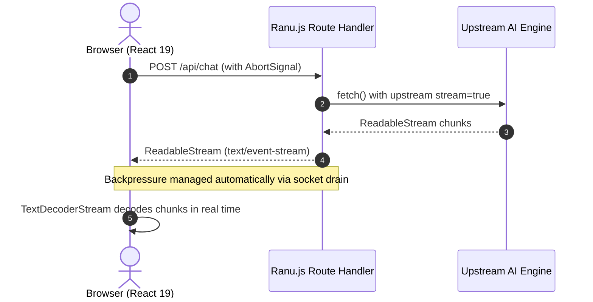

# 02. Streaming & Server-Sent Events Recipes

Real-time streaming is essential for modern AI interfaces. This guide explores the internal mechanics of **Server-Sent Events (SSE)** and **Web Standard Streams** in Ranu.js.

---

## 1. How Streaming Works in Ranu.js

In Ranu.js, API routes run on a high-performance HTTP runtime that communicates natively with W3C standard `Request` and `Response` objects.



### Key Runtime Superpowers:

- **Zero Buffer Overhead:** Chunks are piped directly from the upstream engine to the browser socket without intermediate server caching.
- **Built-in Backpressure:** If a client has a slow mobile connection, Ranu.js pauses reading upstream chunks until the client socket drains, avoiding server memory exhaustion.
- **Immediate Cancellation:** When a client aborts the HTTP request, Ranu.js triggers `request.signal.abort()`, terminating upstream network requests instantly.

---

## 2. Server-Sent Events (SSE) Specification

The standard MIME type for SSE is `text/event-stream`. Each chunk follows the SSE framing protocol:

```text
data: {"content": "Hello"}\n\n
data: {"content": " world"}\n\n
data: [DONE]\n\n
```

### Essential Headers

Every SSE route handler must respond with these headers:

```typescript
const sseHeaders = {
  'Content-Type': 'text/event-stream; charset=utf-8',
  'Cache-Control': 'no-cache, no-transform',
  Connection: 'keep-alive',
};
```

---

## 3. Recipe: Custom Token Transformer Stream

Often, you want to parse raw upstream bytes, extract the text tokens, and stream clean, formatted events down to the client.

Here is how to create a custom `TransformStream` in an API route (`app/api/stream-transform/route.ts`):

```typescript
// app/api/stream-transform/route.ts

function createTokenTransformStream() {
  const textDecoder = new TextDecoder();
  const textEncoder = new TextEncoder();
  let buffer = '';

  return new TransformStream<Uint8Array, Uint8Array>({
    transform(chunk, controller) {
      buffer += textDecoder.decode(chunk, { stream: true });
      const lines = buffer.split('\n');

      // Keep the last partial line in buffer
      buffer = lines.pop() || '';

      for (const line of lines) {
        const trimmed = line.trim();
        if (!trimmed || trimmed.startsWith(':')) continue; // Skip keep-alives

        if (trimmed.startsWith('data:')) {
          const payload = trimmed.replace(/^data:\s*/, '');
          if (payload === '[DONE]') {
            controller.enqueue(textEncoder.encode('event: done\ndata: {}\n\n'));
            return;
          }

          try {
            const parsed = JSON.parse(payload);
            const token = parsed.choices?.[0]?.delta?.content;
            if (token) {
              // Send normalized event
              const outgoing = `event: token\ndata: ${JSON.stringify({ text: token })}\n\n`;
              controller.enqueue(textEncoder.encode(outgoing));
            }
          } catch {
            // Incomplete JSON segment, continue
          }
        }
      }
    },
    flush(controller) {
      if (buffer.trim()) {
        controller.enqueue(textEncoder.encode(`data: ${buffer.trim()}\n\n`));
      }
    },
  });
}

export async function POST(request: Request) {
  const { prompt } = (await request.json()) as { prompt: string };

  const upstream = await fetch(process.env.AI_API_URL!, {
    method: 'POST',
    headers: {
      'Content-Type': 'application/json',
      Authorization: `Bearer ${process.env.AI_API_KEY}`,
    },
    body: JSON.stringify({
      model: 'default',
      messages: [{ role: 'user', content: prompt }],
      stream: true,
    }),
    signal: request.signal,
  });

  if (!upstream.ok || !upstream.body) {
    return Response.json({ error: 'Failed upstream' }, { status: 502 });
  }

  // Pipe upstream body through our transformer
  const transformedStream = upstream.body.pipeThrough(createTokenTransformStream());

  return new Response(transformedStream, {
    headers: {
      'Content-Type': 'text/event-stream; charset=utf-8',
      'Cache-Control': 'no-cache, no-transform',
      Connection: 'keep-alive',
    },
  });
}
```

---

## 4. Recipe: Client Stream Consumer Hook

To keep your React 19 client components clean, encapsulate streaming consumption into a custom hook:

```typescript
// app/hooks/use-ai-stream.ts
import { useState, useCallback, useRef } from 'react';

export function useAiStream() {
  const [data, setData] = useState('');
  const [isStreaming, setIsStreaming] = useState(false);
  const [error, setError] = useState<string | null>(null);
  const abortControllerRef = useRef<AbortController | null>(null);

  const startStream = useCallback(async (url: string, payload: unknown) => {
    setData('');
    setError(null);
    setIsStreaming(true);

    const controller = new AbortController();
    abortControllerRef.current = controller;

    try {
      const res = await fetch(url, {
        method: 'POST',
        headers: { 'Content-Type': 'application/json' },
        body: JSON.stringify(payload),
        signal: controller.signal,
      });

      if (!res.ok || !res.body) {
        throw new Error(`HTTP ${res.status}: ${res.statusText}`);
      }

      const reader = res.body.pipeThrough(new TextDecoderStream()).getReader();
      let fullText = '';

      while (true) {
        const { value, done } = await reader.read();
        if (done) break;

        const lines = value.split('\n');
        for (const line of lines) {
          if (line.startsWith('data:')) {
            const raw = line.slice(5).trim();
            if (raw === '[DONE]') break;
            try {
              const parsed = JSON.parse(raw);
              const chunkText = parsed.text || parsed.choices?.[0]?.delta?.content || '';
              fullText += chunkText;
              setData(fullText);
            } catch {
              // Plain text stream fallback
              fullText += raw;
              setData(fullText);
            }
          }
        }
      }
    } catch (err: unknown) {
      if (err instanceof Error && err.name === 'AbortError') {
        // Stream aborted gracefully
      } else {
        setError(err instanceof Error ? err.message : 'Unknown stream error');
      }
    } finally {
      setIsStreaming(false);
      abortControllerRef.current = null;
    }
  }, []);

  const stopStream = useCallback(() => {
    if (abortControllerRef.current) {
      abortControllerRef.current.abort();
      setIsStreaming(false);
    }
  }, []);

  return { data, isStreaming, error, startStream, stopStream };
}
```

---

## 5. Next Steps

- Explore how to decouple your codebase across multiple providers in **[03. Multi-Provider Patterns](./03_MULTI_PROVIDER_PATTERNS.md)**.
- Review security guardrails in **[04. Security & Best Practices](./04_SECURITY_AND_BEST_PRACTICES.md)**.
